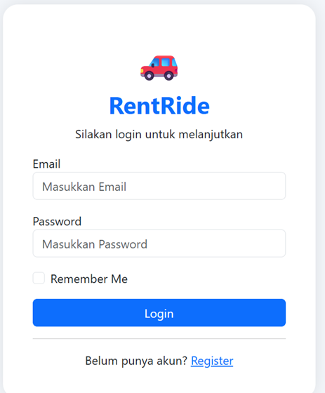
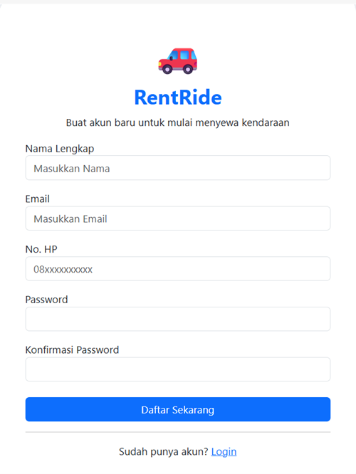
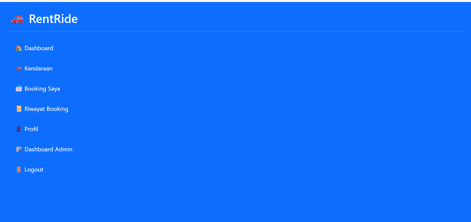
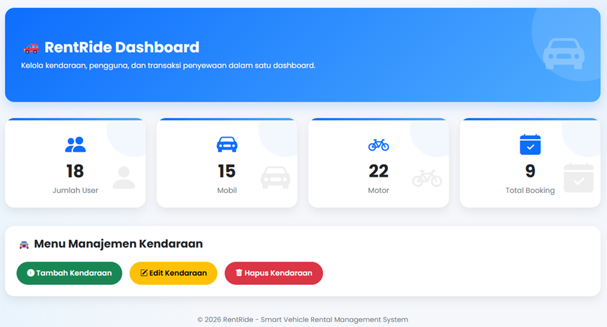
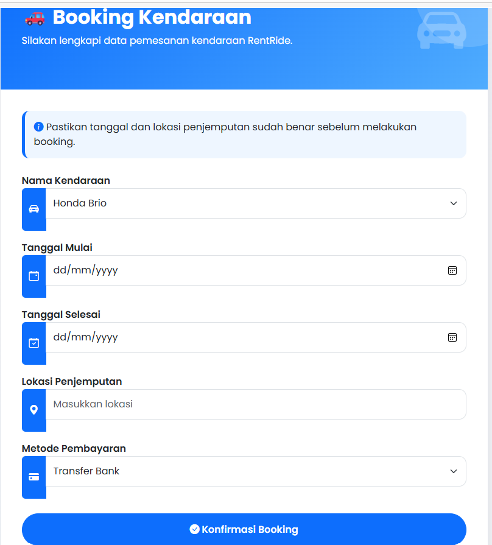
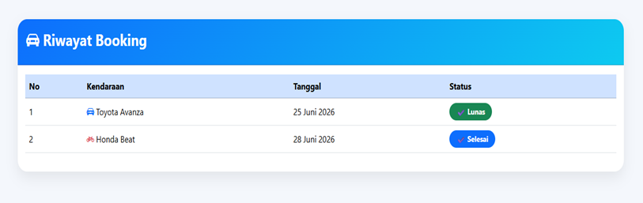
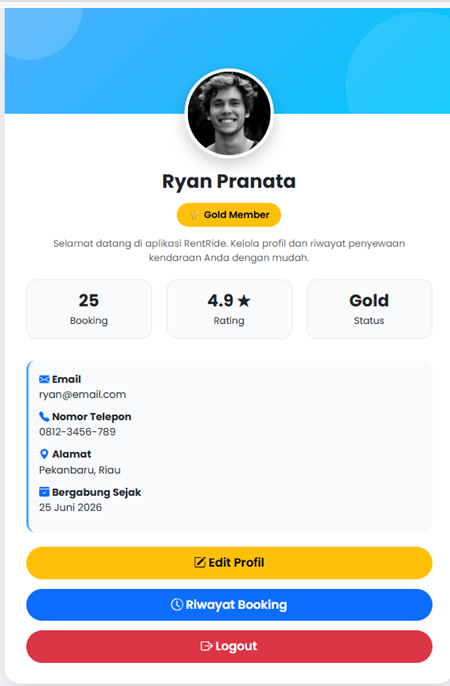
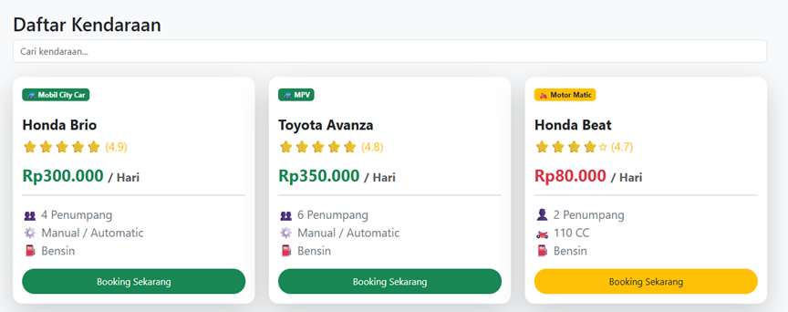

# RentRide


Sewa Motor & Mobil Jadi Lebih Mudah

Platform digital penyewaan kendaraan terpercaya dengan proses booking cepat, aman, dan transparan.

## Fitur
# Screenshot Aplikasi
- Landing Page
## Landing Page


## Landing Page (Section 2)


- Login
 ## Login


- Register
## Register


- Dashboard User
  ## Dashboard User


- Dashboard Admin
## Dashboard Admin


- Booking Kendaraan
  ## Booking Kendaraan


- History Booking
## Riwayat Booking


- Profil User
 ## Profil User


- Vehicles
  ## Daftar Kendaraan



## Teknologi

- HTML
- CSS
- Bootstrap 5
- JavaScript
- Flask
- SQLite

## Cara Menjalankan

pip install -r requirements.txt

python app.py

## 📂 Struktur Folder

```text
RentRide
│
├── screenshots
│
├── static
│   ├── css
│   │   └── style.css
│   ├── js
│   │   └── script.js
│   └── images
│       └── Logo.png
│
├── templates
│   ├── index.html
│   ├── login.html
│   ├── register.html
│   ├── dashboard.html
│   ├── vehicles.html
│   ├── booking.html
│   ├── history.html
│   ├── profile.html
│   └── admin.html
│
├── app.py
├── database.db
├── requirements.txt
└── README.md
```

## 🚀 Fitur Utama

- ✅ Landing Page Responsif
- ✅ Login & Register User
- ✅ Dashboard User
- ✅ Dashboard Admin
- ✅ Daftar Kendaraan
- ✅ Booking Kendaraan
- ✅ Riwayat Booking
- ✅ Profil User
- ✅ Tampilan Responsif Bootstrap 5

## 🎯 Tujuan Project

RentRide merupakan website startup penyewaan kendaraan berbasis web yang dikembangkan sebagai proyek mata kuliah Technopreneurship. Website ini bertujuan mempermudah proses penyewaan mobil dan motor secara digital dengan antarmuka yang sederhana dan mudah digunakan.

## 🔮 Pengembangan Selanjutnya

- Integrasi Database SQLite
- Login menggunakan Session Flask
- Upload Foto Kendaraan
- Payment Gateway
- Google Maps API
- Notifikasi Email
- Dashboard Statistik

## 👨‍💻 Developer

Nama : Ryan Pranata, Muhammad Kahrel, Oktari Primawati

Mata Kuliah : Technopreneurship

Universitas : USTI

Tahun : 2026

## 📄 License

Project ini dibuat untuk keperluan pembelajaran dan tugas mata kuliah Technopreneurship.
